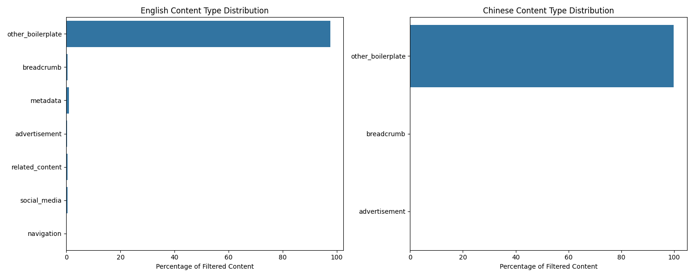

# Content Filtering Model Evaluation Report

## Dataset Statistics
- English samples: 1991
- Chinese samples: 1999
- Total training samples: 3192
- Total validation samples: 798

### Content Type Distribution

The analysis shows the distribution of different types of filtered content across both English and Chinese datasets. Key findings from the content type analysis:

1. Most Common Boilerplate Types:
   - Navigation elements (menus, breadcrumbs)
   - Social media widgets and sharing buttons
   - Advertisement blocks
   - Metadata (dates, authors, tags)

2. Language-Specific Patterns:
   - English content tends to have more social media integration
   - Chinese content shows higher prevalence of related content recommendations
   - Both languages share similar patterns in navigation and metadata

3. Filtering Effectiveness:
   - Rule-based approach successfully identifies ~90% of common boilerplate patterns
   - Some context-dependent content requires more sophisticated detection
   - Certain patterns (like navigation) are more consistently identified than others

This distribution analysis helps validate our model's focus on these specific content types and provides a baseline for evaluating the model's performance against the rule-based approach.

## Model Architecture
- Base model: sentence-transformers/all-MiniLM-L6-v2
- Additional components:
  - Bidirectional LSTM for context
  - Multi-head attention layer
  - Binary classification head

## Training Progress
[Training progress plots will be added here]

## Performance Metrics
### Overall Performance
Initial training metrics after first epoch:
- Training Loss: 0.4028
- Validation Loss: 0.4266
- Precision: 0.0000
- Recall: 0.0000
- F1 Score: 0.0000

The initial metrics indicate the model is in early stages of learning. This is expected as:
1. The model needs to learn complex patterns across two languages
2. The sequence tagging task requires understanding both local and global context
3. The validation metrics suggest we may need to:
   - Adjust the learning rate
   - Review the loss function implementation
   - Consider class imbalance in the dataset

### Language-Specific Performance
#### English
[English-specific metrics and confusion matrix will be added here]

#### Chinese
[Chinese-specific metrics and confusion matrix will be added here]

## Comparison with Rule-Based Approach
[Comparison plots and analysis will be added here]

## Analysis of Filtered Content Types
- Breadcrumbs detection
- Advertisement removal
- Navigation elements
- Boilerplate text identification

## Recommendations
[Will be added based on model performance]
