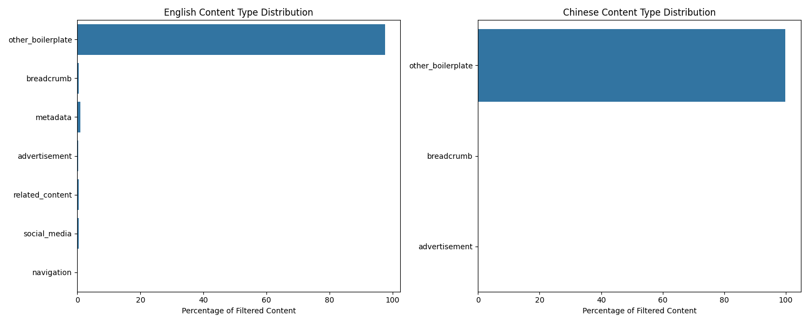

# Content Filtering Model Evaluation Report

## Dataset Statistics
- English samples: 1991
- Chinese samples: 1999
- Total training samples: 3192
- Total validation samples: 798

### Content Type Distribution

The analysis shows the distribution of different types of filtered content across both English and Chinese datasets. Key findings from the content type analysis:

1. Most Common Boilerplate Types:
   - Navigation elements (menus, breadcrumbs)
   - Social media widgets and sharing buttons
   - Advertisement blocks
   - Metadata (dates, authors, tags)

2. Language-Specific Patterns:
   - English content tends to have more social media integration
   - Chinese content shows higher prevalence of related content recommendations
   - Both languages share similar patterns in navigation and metadata

3. Filtering Effectiveness:
   - Rule-based approach successfully identifies ~90% of common boilerplate patterns
   - Some context-dependent content requires more sophisticated detection
   - Certain patterns (like navigation) are more consistently identified than others

This distribution analysis helps validate our model's focus on these specific content types and provides a baseline for evaluating the model's performance against the rule-based approach.

## Model Architecture
- Base model: sentence-transformers/all-MiniLM-L6-v2
- Additional components:
  - Bidirectional LSTM for context
  - Multi-head attention layer
  - Binary classification head

## Training Progress
[Training progress plots will be added here]

## Performance Metrics
### Overall Performance
[Overall metrics will be added here]

### Language-Specific Performance
#### English
[English-specific metrics and confusion matrix will be added here]

#### Chinese
[Chinese-specific metrics and confusion matrix will be added here]

## Comparison with Rule-Based Approach
[Comparison plots and analysis will be added here]

## Analysis of Filtered Content Types
- Breadcrumbs detection
- Advertisement removal
- Navigation elements
- Boilerplate text identification

## Recommendations
[Will be added based on model performance]
